# Ejercicio Entregable 1 - Ajedrez
----------------------------------
En un tablero de ajedrez el caballo es una de las piezas más valoradas. El objetivo de este ejercicio es pintar un tablero de ajedrez con dos caballos, uno negro y uno blanco.

<div>
<p style = 'text-align:center;'>
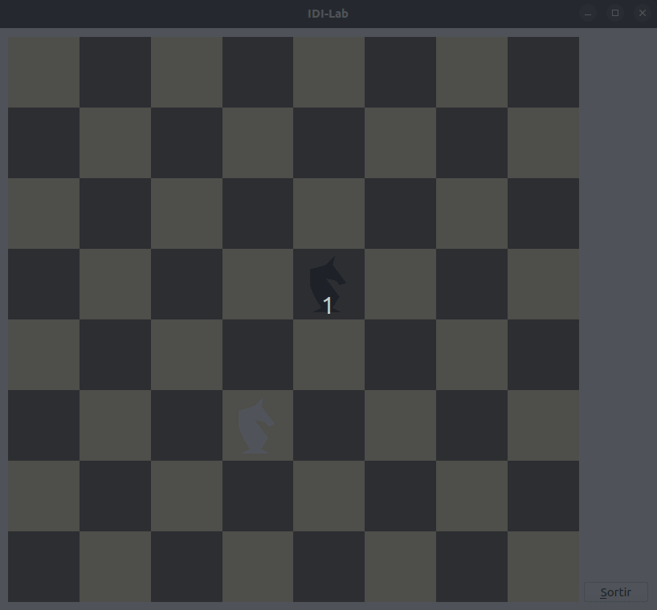<br>
<em>Escena Final</em>
</p>
</div>


## Tabla de Contenidos
----------------------
* [Enunciado](#enunciado)
* [Apartado 1](#apartado-1)
  * [Uniform](#uniform)
  * [Identificador](#identificador)
  * [Linkado](#linkado)
  * [Assignación de valores](#assignación-de-valores)
* [Apartado 2](#apartado-2)
  * [Reescalado de la casilla](#reescalado-de-la-casilla)
  * [Pintar tablero](#pintar-tablero)
  * [Mover caballo al origen de coordenadas](#mover-caballo-al-origen-de-coordenadas)
  * [Orientar correctamente el caballo](#orientar-correctamente-el-caballo)
  * [Lado más largo igual a 0.2](#lado-más-largo-igual-a-02)
  * [Centrar caballo](#centrar-caballo)
  * [Posicionar los caballos](#posicionar-los-caballos)
* [Apartado 3](#apartado-3)
* [Apartado 4](#apartado-4)
* [Apartado 5](#apartado-5)


### Enunciado
-------------
Te proporcionamos un código básico que crea los buffers de un cuadrado de lado 1 centrado en el origen y una pieza de un caballo de ajedrez que no está centrado en el origen ni orientado adecuadamente. La escena inicial que pinta este esqueleto contiene un cuadrado de lado 1 trasladado a la esquina inferior izquierda y el caballo escalado con factor 0.25, todo de color negro.


<div id="figura-1">
<p style = 'text-align:center;'>
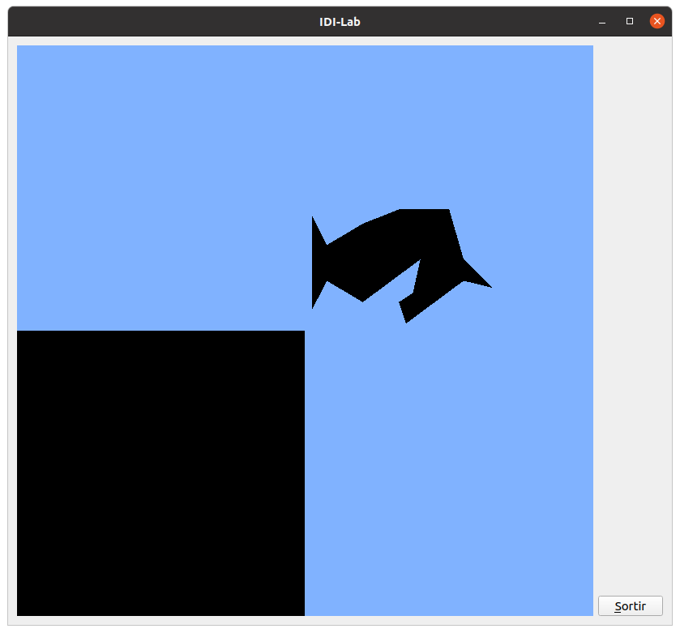<br>
<em>Escena Inicial</em>
</p>
</div>

A partir de este código, resuelve los siguientes ejercicios:

### Apartado 1
--------------
Modifica el código del **fragment shader** para que reciba como un uniform el color del cual se ha de pintar cada objeto. Esto te permitirá decidir de qué color debe ser cada objeto que vayas a pintar. Pinta el cuadrado de color `blancTauler` y el caballo de color `blanc`. Fíjate en que las variables `blancTauler`, `negreTauler`, `blanc` y `negre` contienen la definición de los colores ya definidos en el código inicial (MyGLWidget.h)

#### Uniform
Has de declarar una variable `uniform` en el fragment shader, del tipo `vec3` seguido del nombre de la variable.
```cpp
// basicShader.frag
#version 330 core

uniform vec3 color;
out vec4 FragColor;

void main() {
    FragColor = vec4(color,1);
}
```
#### Identificador
Para poder usar el uniform y darle valores, tienes que declarar un identificador para el uniform en MyGLWidget.h
```cpp
// MyGLWidget.h
  private:
    ...
    GLuint colorLoc;
```
#### Linkado
Has de asociar este identificador con el uniform que has creado en el fragment shader usando la función `glGetUniformLocation()` (solo hace falta hacerlo una vez).
```cpp
//MyGLWidget.cpp
void MyGLWidget::carregaShaders() {
  ... 
  // Obtenim els identificadors dels uniforms
  TGLoc = glGetUniformLocation(program->programId(), "TG");
  colorLoc = glGetUniformLocation(program->programId(), "color");
}
```
#### Asignación de valores
Puedes darle valor al uniform usando su identificador y la función `glUniform...()`
```cpp
// MyGLWidget.cpp
void MyGLWidget::paintGL () {
  ...
  // Pintem un quadrat
  glUniform3fv(colorLoc,1,&negreTauler[0]);
  glBindVertexArray(VAOQuadrat);
  modelTransformQuadrat(glm::vec3(-0.5,-0.5,0.0));
  glDrawArrays(GL_TRIANGLES, 0, 6);    		
  glBindVertexArray(0);
  
  // Pintem un cavall
  glUniform3fv(colorLoc,1,&blanc[0]);
  modelTransformCavall(glm::vec3(0.0,0.0,0.0));
  glBindVertexArray(VAOCavall);
  glDrawArrays(GL_TRIANGLES, 0, 45);  
  glBindVertexArray(0);
  
  // Desactivem el VAO
  glBindVertexArray(0);
}
```

<div>
<p style = 'text-align:center;'>
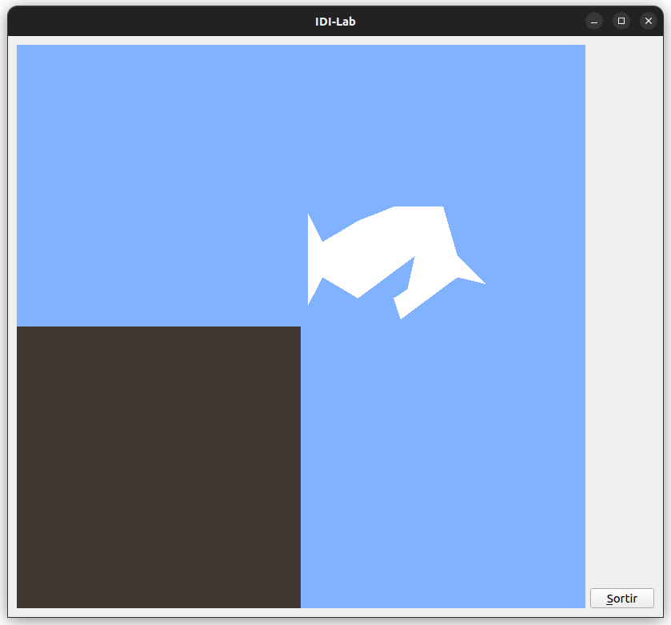<br>
<em>Escena Inicial con colores</em>
</p>
</div>


### Apartado 2
--------------
Modifica la escena para pintar un tablero de ajedrez que ocupe todo el viewport. El tablero son 8x8 casillas alternando los colores `blancTauler` y `negreTauler`, con cuadro blanco (`blancTauler`) en la esquina de arriba a la izquierda.

#### Reescalado de la casilla
Has de reescalar los cuadrados de lado 1 para que sean de lado igual a 0.25. Ten en cuenta que la escena que estás viendo las x,y,z pertenecen a [-1,1]. Es decir, que entre la minX y la maxX hay una distancia de 2 unidades. Si quieres hacer que quepan 8 cuadrados consecutivos, estos han de ser de lado igual a 2/8 = 0.25.
```cpp
void MyGLWidget::modelTransformQuadrat(glm::vec3 posicio) {
  glm::mat4 TG(1.0f);
  TG = glm::translate(TG, posicio);
  TG = glm::scale(TG,glm::vec3(0.25,0.25,0.25)); 
  glUniformMatrix4fv(TGLoc, 1, GL_FALSE, &TG[0][0]);
}
```

Añade también a la escena una pieza de caballo blanco y una pieza de caballo negro orientadas correctamente. La escala de las piezas del caballo será tal que su lado más largo mida 0.2.

#### Pintar tablero
Podemos ver el tablero en realidad como una matriz de casillas, donde si se le asigna un número a cada casilla, las casillas pares son de color negro y las casillas impares de color blanco.
Por tanto, podemos tratar de crear el tablero haciendo un bucle anidado y poner una condición booleana que pinte la casilla del color que le toca en funcion de su paridad.

<div>
<p style = 'text-align:center;'>
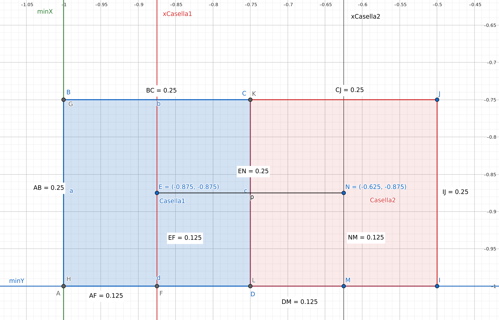<br>
<em>La casilla azul es la primera que se pinta. Está situada abajo a la izquierda, con centro en (-0,0875,-0.875). Para pintar las siguientes casillas, es necesario realizar desplazamientos de 0.25</em>
</p>
</div>

```cpp
void MyGLWidget::paintGL() {
    ...
    // Pintem tauler d'escacs
    glBindVertexArray(VAOQuadrat);
    int k = 0;
    for (float j = -0.875; j < 1.0; j += 0.25) {
        int s = 0;
        for (float i = -0.875; i < 1.0; i += 0.25) {
            if ((k+s)%2 == 0) glUniform3fv(colorLoc,1,&negreTauler[0]);
            else glUniform3fv(colorLoc,1,&blancTauler[0]);
            ++s;
            modelTransformQuadrat(glm::vec3(i,j,0.0));
            glDrawArrays(GL_TRIANGLES, 0, 6);
        }               
        ++k;
    }
    k = 0;
    glBindVertexArray(0);
    ...
}
```

#### Mover caballo al Origen de Coordenadas
Recuerda que dentro del código que te dan, en los comentarios de creaBuffersCavall() te indican los valores de los puntos mínimos y máximos. Con ello puedes calcular cuanto mide el lado más largo, en este caso, 2.5.
```cpp
void MyGLWidget::creaBuffersQuadrat() {
    glm::vec3 Vertices[6]; // vèrtexs amb X, Y i Z
    // minX = -0.5
    // maxX = 0.5
    // minY = -0.5
    // maxY = 0.5
    ...
}
```
El problema es que el reescalado produce una traslación de los vértices, cambiando así la posición donde está situado. El objeto será más grande, pero estará situado en otro sitio. Excepto si uno de sus ver cites está situado en el origen de coordenadas (0,0,0). En tal caso, el objeto será más grande, pero continuará situado el origen de coordenadas, como si hubiésemos fijado su posición.


<div>
<p style = 'text-align:center;'>
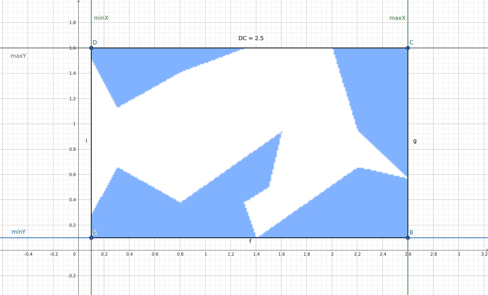<br>
<em>Posicio original del cavall, donde su lado mas largo mide 2.5</em>
</p>
</div>

Es muy importante operar la secuencia de transformaciones en el orden correcto, ya que *`el producto de matrices no posee la propiedad conmutativa.`* Es decir, no conseguiremos el mismo resultado si primero rotamos y trasladamos, que si trasladamos y después rotamos.

Para conseguir lo que queremos tenemos que tener uno de los vértices en el origen de coordenadas sobre el cual se articulara la rotación y el escalado. Es por ello que primero tenemos que hacer una translación del caballo. Conociendo su posición en el plano y que su punto mínimo'(0.1,0.1,0.0)'es el que está más próximo al origen de coordenadas, resulta más simple trasladar al caballo la distancia que hay entre el origen de coordenadas y el punto mínimo, que es, -puntominimo.
```cpp
  TG = glm::translate(TG,glm::vec3(-0.1,-0.1,0.0)); 
```
<div>
<p style = 'text-align:center;'>
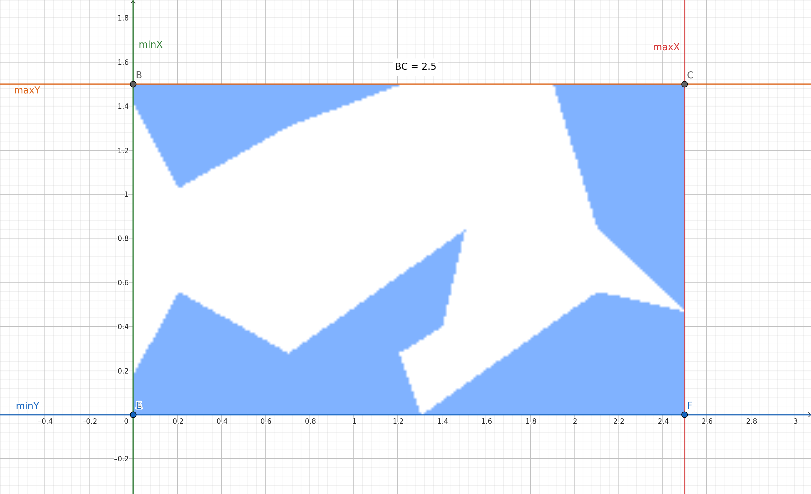<br>
<em>Caballo trasladado al centro de coordenadas</em>
</p>
</div>


#### Orientar correctamente el caballo

Puedes orientar el caballo correctamente haciendo una rotación de 90 grados respecto al eje Z, en el sentido contrario a las agujas del reloj.
Recuerda que los ángulos positivos son en sentido antihorario y los negativos en sentido horario.

```cpp
  TG = glm::rotate(TG,float(M_PI)/2,glm::vec3(0.0f,0.0f,1.0f));
```

<div>
<p style = 'text-align:center;'>
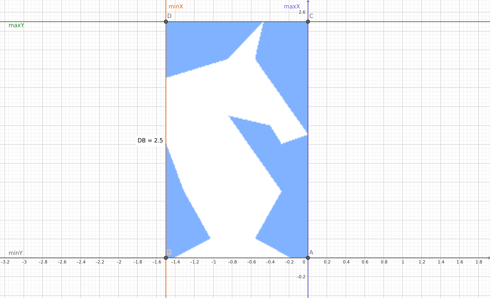<br>
<em>Caballo después haber sido rotado 90 grados</em>
</p>
</div>

#### Lado más largo igual a 0.2

El factor de escala λ, podemos encontrarlo de la siguiente manera:
```{r}
2.5*λ = 0.2
λ = 0.2/2.5
λ = 0.08
```
Ya con el caballo correctamente orientado, el factor de escala encontrado y uno de sus vértices situado en el origen, podemos escalar efectivamente sin perder la posición.
```cpp
TG = glm::scale(TG,glm::vec3(0.08,0.08,0.08));
```
<div>
<p style = 'text-align:center;'>
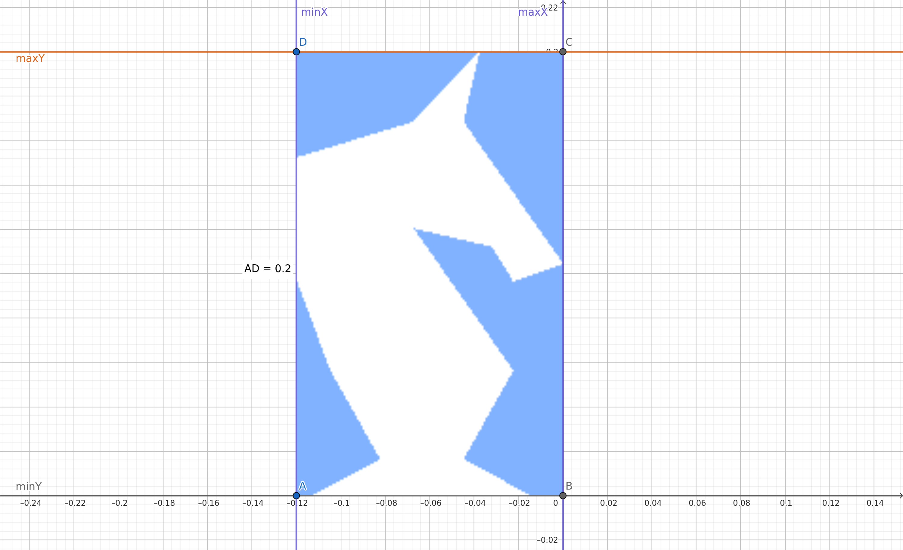<br>
<em>Caballo reescalado para que tenga el lado más grande igual a 0.2</em>
</p>
</div>

En total tendremos que haber añadido a la función `modelTransformCavall()` las operaciones de translate, rotate y scale anteriormente mencionadas.
```cpp
//MyGLWidget.cpp
void MyGLWidget::modelTransformCavall(glm::vec3 posicio)
{
  glm::mat4 TG(1.0f);
  TG = glm::translate(TG, posicio);
  TG = glm::scale(TG,glm::vec3(0.08,0.08,0.08)); 
  TG = glm::rotate(TG,float(M_PI)/2,glm::vec3(0.0f,0.0f,1.0f));
  TG = glm::translate(TG,glm::vec3(-0.1,-0.1,0.0));  
  glUniformMatrix4fv(TGLoc, 1, GL_FALSE, &TG[0][0]);
}
```
El centro del caballo negro debe ser la posición (0.125, 0.125, 0) mientras que el centro del caballo blanco debe ser la posición (-0.125, -0.375, 0).
#### Centrar caballo
Las translaciones siempre se hacen respecto al centro del objeto, es por ello que para poder enviarle a través de la `modelTransform()` las nuevas posiciones donde queremos tener el caballo es necesario tener centrado el caballo en el origen de coordenadas.
```cpp
TG = glm::translate(TG,glm::vec3(0.06,-0.1,0.0));  
```
<div>
<p style = 'text-align:center;'>
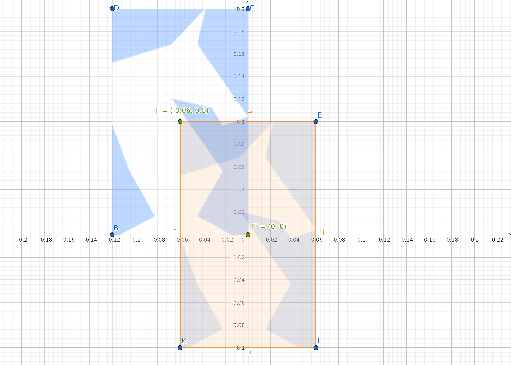<br>
<em>Caballo centrado en el origen de coordenadas</em>
</p>
</div>
```cpp
void MyGLWidget::modelTransformCavall(glm::vec3 posicio)
{
  glm::mat4 TG(1.0f);
  TG = glm::translate(TG, posicio);
  TG = glm::translate(TG,glm::vec3(0.06,-0.1,0.0));  
  TG = glm::scale(TG,glm::vec3(0.08,0.08,0.08));  
  TG = glm::rotate(TG,float(M_PI)/2,glm::vec3(0.0f,0.0f,1.0f));
  TG = glm::translate(TG,glm::vec3(-0.1,-0.1,0.0));  
  glUniformMatrix4fv(TGLoc, 1, GL_FALSE, &TG[0][0]);
}
```

#### Posicionar los caballos
El centro del caballo se encuentra en el punto (0.0, 0.0, 0.0). Solo hay que restar este punto al nuevo centro para encontrar los valores que tenemos que trasladar.
```r
## Vector de translación = Nuevo centro - Centro caballo
## +-----------------+-----------------------+-----------------------+
## | Centro caballo  |      Nuevo centro     | Vector de translación |
## +-----------------+-----------------------+-----------------------+
     (0.0, 0.0, 0.0) | ( 0.125,  0.125, 0.0) | ( 0.125,  0.125, 0.0) 
     (0.0, 0.0, 0.0) | (-0.125, -0.375, 0.0) | (-0.125, -0.375, 0.0) 
```
<div>
<p style = 'text-align:center;'>
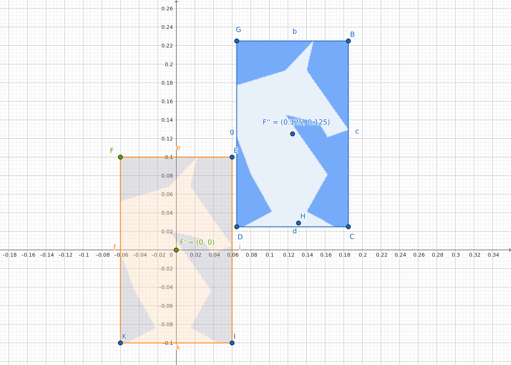<br>
<em>Translación del caballo desde F' a F''</em>
</p>
</div>

```cpp
//MyGLWidget.cpp
void MyGLWidget::paintGL () {
    ...
    // Pintem un cavall negre
    glUniform3fv(colorLoc,1,&negre[0]);
    modelTransformCavall(glm::vec3(0.125,0.125,0.0));
    glBindVertexArray(VAOCavall);
    glDrawArrays(GL_TRIANGLES, 0, 45); 
    // Desactivem el VAO 
    glBindVertexArray(0);
    
    // Pintem un cavall blanc
    glUniform3fv(colorLoc,1,&blanc[0]);
    modelTransformCavall(glm::vec3(-0.125,-0.375,0.0));
    glBindVertexArray(VAOCavall);
    glDrawArrays(GL_TRIANGLES, 0, 45);  
    // Desactivem el VAO
    glBindVertexArray(0);
}
```
<div>
<p style = 'text-align:center;'>
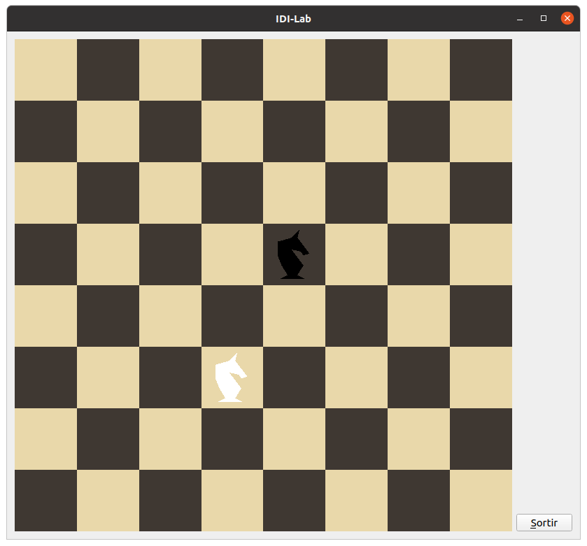<br>
<em>Escena Final sin funcionalidades</em>
</p>
</div>

### Apartado 3
--------------
Haz que cuando se pulse la tecla ‘C’ el caballo blanco se coma al caballo negro, es decir, sólo tienes que pintar el caballo blanco en la posición en la que estaba el negro. Cuando se vuelve a pulsar la tecla 'C' se vuelve al estado anterior. Este cambio de estado debe ser cıclico.
```cpp
// MyGLWidget.h
  private:
    ...
    bool menjat;
```
```cpp
// MyGLWidget.cpp
void MyGLWidget::initializeGL() {
    // Cal inicialitzar l'ús de les funcions d'OpenGL
    initializeOpenGLFunctions();

    glClearColor(0.5, 0.7, 1.0, 1.0); // defineix color de fons (d'esborrat)
    carregaShaders();
    creaBuffersQuadrat();
    creaBuffersCavall();
    menjat = false;
}
```

```cpp
// MyGLWidget.cpp
void MyGLWidget::keyPressEvent(QKeyEvent* event) {
    makeCurrent();
    switch (event->key()) {
        ...	
        case Qt::Key_C: 
            menjat = !menjat;
            break;
        default: event->ignore(); break;
  }
  update();
}
```
```cpp
// MyGLWidget.cpp
void MyGLWidget::paintGL () {
  ...
  // Pintem un cavall negre
  if (!menjat) glUniform3fv(colorLoc,1,&negre[0]);
  else glUniform3fv(colorLoc,1,&blanc[0]);
  modelTransformCavall(glm::vec3(0.125,0.125,0.0));
  glBindVertexArray(VAOCavall);
  glDrawArrays(GL_TRIANGLES, 0, 45);  
  glBindVertexArray(0);
  
  // Pintem un cavall blanc
  if (!menjat) {  
      glUniform3fv(colorLoc,1,&blanc[0]);
      modelTransformCavall(glm::vec3(-0.125,-0.375,0.0));
      glBindVertexArray(VAOCavall);
      glDrawArrays(GL_TRIANGLES, 0, 45);  
      glBindVertexArray(0);
  }
  
  // Desactivem el VAO
  glBindVertexArray(0);
}
```
### Apartado 4
--------------
Haz que al pulsar las teclas 'S' y 'D' toda la escena se haga mayor o menor, con factor de escala incrementado o decrementado con 0.1 respectivamente (+0.1 o -0.1). Pon lımites en el factor de escala para que el factor esté siempre dentro del rango [0.1, 2.0].
```cpp
// MyGLWidget.h
  private:
    ...
    float scl;
```
```cpp
// MyGLWidget.cpp
void MyGLWidget::initializeGL() {
    // Cal inicialitzar l'ús de les funcions d'OpenGL
    initializeOpenGLFunctions();

    glClearColor(0.5, 0.7, 1.0, 1.0); // defineix color de fons (d'esborrat)
    carregaShaders();
    creaBuffersQuadrat();
    creaBuffersCavall();
    menjat = false;
    scl = 1.0f;
}
```

```cpp
// MyGLWidget.cpp
void MyGLWidget::keyPressEvent(QKeyEvent* event) {
    makeCurrent();
    switch (event->key()) {
        case Qt::Key_S:
            if (scl < 2.0f) scl += 0.1f;
            break;
        case Qt::Key_D: 
            if (scl > 0.1f) scl -= 0.1f;
            break;
    }
    update();
}
```

```cpp
// MyGLWidget.cpp
void MyGLWidget::modelTransformQuadrat(glm::vec3 posicio) {
  glm::mat4 TG(1.0f);
  TG = glm::scale(TG,glm::vec3(scl));
  TG = glm::translate(TG, posicio);
  TG = glm::scale(TG,glm::vec3(0.25,0.25,0.25)); 
  glUniformMatrix4fv(TGLoc, 1, GL_FALSE, &TG[0][0]);
}

void MyGLWidget::modelTransformCavall(glm::vec3 posicio) {
  glm::mat4 TG(1.0f);
  TG = glm::scale(TG,glm::vec3(scl));
  TG = glm::translate(TG, posicio);
  TG = glm::translate(TG,glm::vec3(0.06,-0.1,0.0));  
  TG = glm::scale(TG,glm::vec3(0.08,0.08,0.08));  
  TG = glm::rotate(TG,float(M_PI)/2,glm::vec3(0.0f,0.0f,1.0f));
  TG = glm::translate(TG,glm::vec3(-0.1,-0.1,0.0));  
  glUniformMatrix4fv(TGLoc, 1, GL_FALSE, &TG[0][0]);
}
```

### Apartado 5
--------------
Fes que en prémer les tecles ’E’ i ’R’ tota l’escena roti respecte de l’eix Z, incrementat o decrementant 1 grau respectivament (+1 grau o -1 grau) l’angle de rotació (pots veure una possible imatge amb escalat i rotació al fitxer escenaFinal-3).
Haz que al pulsar las teclas 'E' y 'R' toda la escena rote respecto del eje Z, incrementado o decrementando 1 grado respectivamente (+1 grado o -1 grado) el ángulo de rotación.

```cpp
// MyGLWidget.h
  private:
    ...
    angle = 0.0f;
```
```cpp
// MyGLWidget.cpp
void MyGLWidget::initializeGL() {
    // Cal inicialitzar l'ús de les funcions d'OpenGL
    initializeOpenGLFunctions();

    glClearColor(0.5, 0.7, 1.0, 1.0); // defineix color de fons (d'esborrat)
    carregaShaders();
    creaBuffersQuadrat();
    creaBuffersCavall();
    menjat = false;
    scl = 1.0f;
    angle = 0.0f;
}
```

```cpp
// MyGLWidget.cpp
void MyGLWidget::keyPressEvent(QKeyEvent* event) {
    makeCurrent();
    switch (event->key()) {
       case Qt::Key_E:
        angle += float(M_PI)/180;
    	break;
    case Qt::Key_R: 
        angle -= float(M_PI)/180;
    	break;	
    }
    update();
}
```

```cpp
// MyGLWidget.cpp
void MyGLWidget::modelTransformQuadrat(glm::vec3 posicio) {
  glm::mat4 TG(1.0f);
  TG = glm::rotate(TG,angle,glm::vec3(0.0f,0.0f,1.0f));
  TG = glm::scale(TG,glm::vec3(scl));
  TG = glm::translate(TG, posicio);
  TG = glm::scale(TG,glm::vec3(0.25,0.25,0.25)); 
  glUniformMatrix4fv(TGLoc, 1, GL_FALSE, &TG[0][0]);
}

void MyGLWidget::modelTransformCavall(glm::vec3 posicio) {
  glm::mat4 TG(1.0f);
  TG = glm::rotate(TG,angle,glm::vec3(0.0f,0.0f,1.0f));
  TG = glm::scale(TG,glm::vec3(scl));
  TG = glm::translate(TG, posicio);
  TG = glm::translate(TG,glm::vec3(0.06,-0.1,0.0));  
  TG = glm::scale(TG,glm::vec3(0.08,0.08,0.08));  
  TG = glm::rotate(TG,float(M_PI)/2,glm::vec3(0.0f,0.0f,1.0f));
  TG = glm::translate(TG,glm::vec3(-0.1,-0.1,0.0));  
  glUniformMatrix4fv(TGLoc, 1, GL_FALSE, &TG[0][0]);
}
```